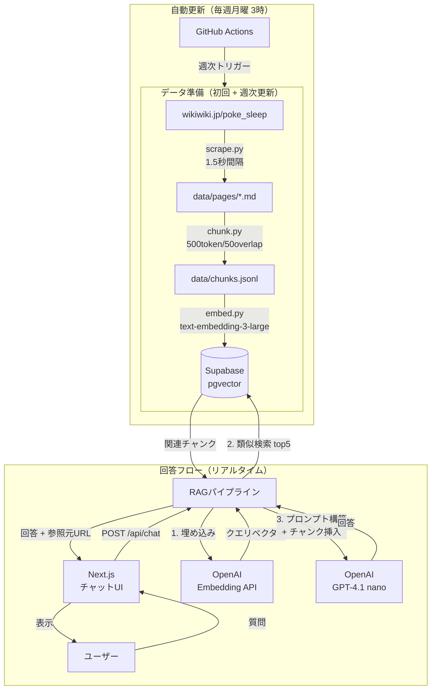

# ポケスリwiki RAGチャットボット — 実装仕様書

## システム構成図



## プロジェクト概要

ポケスリ（Pokémon Sleep）の攻略wikiをデータソースとして、初心者の質問に自然な言葉で答えるRAGチャットボットを構築する。無料で公開する非公式ファンツール。

- **データソース**: https://wikiwiki.jp/poke_sleep/
- **公開形態**: Vercelにデプロイ・無料公開
- **ターゲット**: ポケスリ初心者

---

## 技術スタック

| レイヤー | 採用技術 |
|---|---|
| フロントエンド | Next.js 14（App Router）+ Tailwind CSS |
| バックエンド | Next.js API Routes |
| 埋め込みモデル | OpenAI `text-embedding-3-large` |
| LLM | OpenAI `gpt-4.1-nano` |
| ベクターDB | Supabase（pgvector拡張） |
| スクレイピング | Python 3.x + BeautifulSoup4 + requests |
| デプロイ | Vercel |
| wiki更新自動化 | GitHub Actions |

---

## ディレクトリ構成

```
pokeslee-rag/
├── scripts/                  # Pythonスクリプト（データ準備用）
│   ├── scrape.py             # wikiスクレイピング
│   ├── chunk.py              # テキストのチャンク分割
│   └── embed.py              # 埋め込み生成・Supabaseへの格納
├── src/
│   └── app/
│       ├── page.tsx           # チャットUI
│       ├── layout.tsx
│       └── api/
│           └── chat/
│               └── route.ts  # RAGパイプライン
├── .env.local                # 環境変数（git管理外）
├── .github/
│   └── workflows/
│       └── update-wiki.yml   # 週次wiki更新
└── package.json
```

---

## 環境変数

`.env.local` に以下を設定する。

```
OPENAI_API_KEY=sk-...
SUPABASE_URL=https://xxxx.supabase.co
SUPABASE_SERVICE_ROLE_KEY=eyJ...
NEXT_PUBLIC_SUPABASE_URL=https://xxxx.supabase.co   # フロントで使う場合のみ
```

---

## Phase 1: wikiスクレイピング（`scripts/scrape.py`）

### 仕様

1. `https://wikiwiki.jp/poke_sleep/` のトップページからリンク一覧を取得する
2. 同一ドメイン内のページリンクを再帰的に収集する（深さ制限：3）
3. `robots.txt` を取得し、`User-agent: *` の `Disallow` に該当するURLはスキップする
4. クエリパラメータ（`?`以降）を含むURLはスキップする
5. 以下のパスを除外する（例）：`/edit/`, `/diff/`, `/attach/`, `/search`, `/recent`, `/help`
6. 各ページのHTMLを取得し、メインコンテンツ部分のテキストを抽出する（DOMセレクタは代表ページ5〜10件で確認して確定し、コード内で1箇所に定数化）
7. Markdownファイルとしてローカルの `data/pages/` に保存する
8. リクエスト間隔は **1.5秒以上** 空ける（429/503時は指数バックオフ）
9. HTTPタイムアウトは10秒、リトライは最大3回（指数バックオフ）とする
10. 抽出本文が短すぎる場合（例: 300文字未満）はログに警告を出す

### 出力形式

```
data/pages/
├── index.md
├── ポケモン一覧.md
├── マリルリ.md
└── ...
```

各ファイルの先頭にメタデータを付与する：

```markdown
---
url: https://wikiwiki.jp/poke_sleep/マリルリ
title: マリルリ
content_hash: sha256(本文正規化後)
scraped_at: 2026-04-03T00:00:00
---

# マリルリ

（本文）
```

### ファイル名ルール

- URL末尾のパスをベースにファイル名を作る
- `/`・`:`・`?`・`#` などOS非対応文字は `_` に置換する
- 同名衝突が起きる場合は末尾に `__{短いハッシュ}` を付与する

---

## Phase 2: チャンク分割（`scripts/chunk.py`）

### 仕様

1. `data/pages/` の全Markdownファイルを読み込む
2. 以下のルールでチャンク分割する：
   - チャンクサイズ：**500トークン**
   - オーバーラップ：**50トークン**
   - 分割の優先順位：見出し（`#`）> 段落 > 文
   - トークン計測は `tiktoken` の `cl100k_base` を使用する
   - 文分割は `。！？` を終端とする（日本語向け簡易）
3. 各チャンクに元ページのメタデータ（url, title）を付与する
4. `data/chunks.jsonl` に1行1チャンクのJSONL形式で保存する

### chunks.jsonlの各行フォーマット

```json
{
  "id": "マリルリ_001",
  "url": "https://wikiwiki.jp/poke_sleep/マリルリ",
  "title": "マリルリ",
  "content_hash": "ページ本文のsha256",
  "text": "マリルリはウォータータイプのポケモンで..."
}
```

### IDルール

- `{ページslug}_{連番3桁}` で固定
- 同一ページ内の順序が変わらない限り、IDは安定させる

---

## Phase 2.5: チャンク規模の再設計（メモ）

チャンク作成後に以下を集計し、必要なら再設計する：

- 総チャンク数
- 総トークン数
- 平均チャンク長（tokens）
- 長すぎる/短すぎるチャンクの比率

再設計の判断基準（例）：

- 総チャンク数が多すぎる場合は、チャンクサイズ拡大やオーバーラップ削減を検討
- 検索精度が低い場合は、見出し優先度や分割ルールを調整

集計用スクリプトを作る場合は `scripts/inspect_chunks.py` を想定する。

---

## Phase 3: 埋め込み生成・DB格納（`scripts/embed.py`）

### Supabaseテーブル定義

Supabaseのコンソール上で以下のSQLを実行してテーブルを作成する。

```sql
create extension if not exists vector;

create table wiki_chunks (
  id text primary key,
  url text not null,
  title text not null,
  content_hash text not null,
  text text not null,
  embedding vector(3072),
  updated_at timestamp with time zone default now()
);

create index on wiki_chunks
using ivfflat (embedding vector_cosine_ops)
with (lists = 100);
```

### スクリプト仕様

1. `data/chunks.jsonl` を読み込む
2. OpenAI `text-embedding-3-large` で各チャンクの `text` を埋め込みベクターに変換する
3. Supabaseの `wiki_chunks` テーブルにupsertする
4. APIリクエストは **20件ずつバッチ処理** する（レート制限対策）
5. `content_hash` が同じ場合は埋め込み生成とupsertをスキップする
6. 失敗時は最大3回リトライ（指数バックオフ）
7. 処理完了後、今回取得したURL一覧と `wiki_chunks` テーブルのURL一覧を突合し、今回取得できなかったURLのレコードを `wiki_chunks` から削除する（`embed.py` の末尾に実装）

---

## Phase 4: RAGパイプライン（`src/app/api/chat/route.ts`）

### 処理フロー

```
POST /api/chat
  ├── リクエストボディ: { message: string, history: Message[] }
  ├── 1. ユーザーの質問をOpenAI埋め込みでベクター化
  ├── 2. Supabaseで上位5件の類似チャンクを取得
  ├── 3. 取得チャンクをコンテキストとしてプロンプトを構築
  ├── 4. OpenAI `gpt-4.1-nano` に送信
  └── レスポンス: { answer: string, sources: Source[] }
```

### Supabase類似検索クエリ

```sql
select id, url, title, text,
  1 - (embedding <=> '[クエリベクター]') as similarity
from wiki_chunks
order by embedding <=> '[クエリベクター]'
limit 5;
```

### 類似検索実装メモ

- 実装では必ずパラメータ化する（文字列埋め込み禁止）
- `similarity` の初期しきい値は簡易評価で決める（例: 0.65/0.70/0.75/0.80 を比較）
- 0件の場合は「wikiには記載がありませんでした」と返す
- 運用時に類似度分布のログを見てしきい値を再調整する

### システムプロンプト

```
あなたはポケスリ（Pokémon Sleep）の初心者向けアシスタントです。
以下のwiki情報をもとに、やさしく丁寧に答えてください。

ルール：
- 提供されたwiki情報に基づいてのみ回答する
- wiki情報に記載がない場合は「wikiには記載がありませんでした」と答える
- 初心者にわかりやすい言葉を使う
- 回答は簡潔に、200字以内を目安にする

【wiki情報】
{context}
```

### API I/O

リクエスト:

```json
{
  "message": "string",
  "history": [
    { "role": "user" | "assistant", "content": "string" }
  ]
}
```

レスポンス:

```json
{
  "answer": "string",
  "sources": [
    { "url": "string", "title": "string", "snippet": "string" }  // snippetはchunkのtext先頭100文字
  ]
}
```

### エラーハンドリング

- 4xx: 入力不正（空文字、500文字超の入力）
- 5xx: 外部API/Supabase障害
- 失敗時は `answer` にユーザー向け短文を返す

### OpenAI API実装方針

- Responses API を使用する
- LLM呼び出しは関数に分離し、モデル差し替えを容易にする

---

## Phase 5: フロントエンド（`src/app/page.tsx`）

### UI仕様

- シンプルなチャット画面（入力欄 + 吹き出し形式の会話履歴）
- モバイルファーストのレスポンシブデザイン
- ページ下部に免責事項を表示する：

```
このツールは非公式のファンメイドツールです。
©2023 Pokémon. ©1995-2023 Nintendo/Creatures Inc./GAME FREAK inc.
```

- 回答の下に参照元wikiページのリンクを表示する（Sourcesとして）
- ローディング中はスピナーを表示する
- APIエラー時は1行のエラーメッセージを表示する

### 会話履歴の管理

- `useState` でローカル管理（DBに保存しない）
- 直近10件のみAPIに渡す（トークン節約）

---

## Phase 6: GitHub Actionsによる週次更新（`.github/workflows/update-wiki.yml`）

### 仕様

- **スケジュール**: 毎週月曜日 午前3時（JST）
- **処理内容**:
  1. `scripts/scrape.py` を実行してwikiを再取得
  2. `scripts/chunk.py` を実行
  3. `scripts/embed.py` を実行（差分のみupsert）
- **必要なSecrets**: `OPENAI_API_KEY`, `SUPABASE_URL`, `SUPABASE_SERVICE_ROLE_KEY`
- **依存関係**: `pip install -r scripts/requirements.txt` を事前に実行する
- **削除対応**: 更新時に「今回取得できたURL一覧」を保存し、DB内のURLと突合して未取得ページは削除（先にdry-runで差分確認）

```yaml
on:
  schedule:
    - cron: '0 18 * * 0'  # 日曜18:00 UTC = 月曜03:00 JST
  workflow_dispatch:       # 手動実行も可能
```

---

## Vercelデプロイ設定

1. GitHubリポジトリをVercelに接続する
2. Framework Preset: **Next.js**
3. 環境変数を Vercel のダッシュボードで設定する（`.env.local` と同じ4つ）
4. デプロイブランチ: `main`

---

## 実装依頼の順序

Claudeへの依頼はこの順番で行う。各フェーズが完了してから次に進む。

1. `scripts/scrape.py` の作成と動作確認
2. `scripts/chunk.py` の作成と動作確認
3. Supabaseのテーブル作成（SQLをそのまま実行）
4. `scripts/embed.py` の作成と動作確認
5. `src/app/api/chat/route.ts` の作成
6. `src/app/page.tsx` の作成
7. Vercelデプロイ
8. `.github/workflows/update-wiki.yml` の作成

---

## 注意事項

- wikiスクレイピング時のリクエスト間隔は必ず1.5秒以上空けること
- ツール上に「非公式・ファンメイド」の表記を必ず入れること
- Nintendo/Pokémon関連コンテンツの商用利用は不可
- APIキーは絶対にgitにコミットしないこと（`.gitignore` に `.env.local` を追加）
